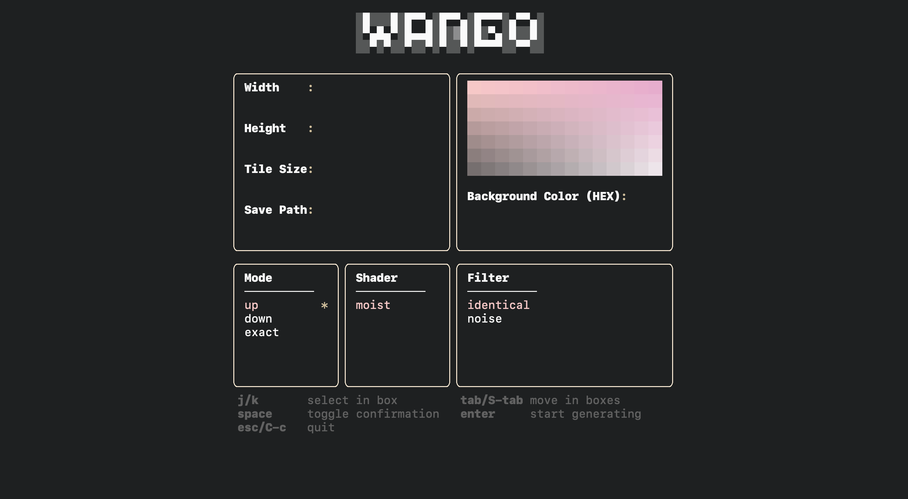

# wango

wang's tile artwork generator impl by go.




# features

* user-friendly tui.
* random seed and repeatable output.
* smooth color blending.
* various filters.

# millstone


```bash
# test
make test && open grid.png

# run
# - empty input will use default config instead
# - just run and press ENTER
go run . 

```

# todo

[ ] seed support
 
[ ] add some filters like sobel, etc.

[ ] prettier layout

# usage 

refer to help subcommand.
```go
wango help

```

# reference

