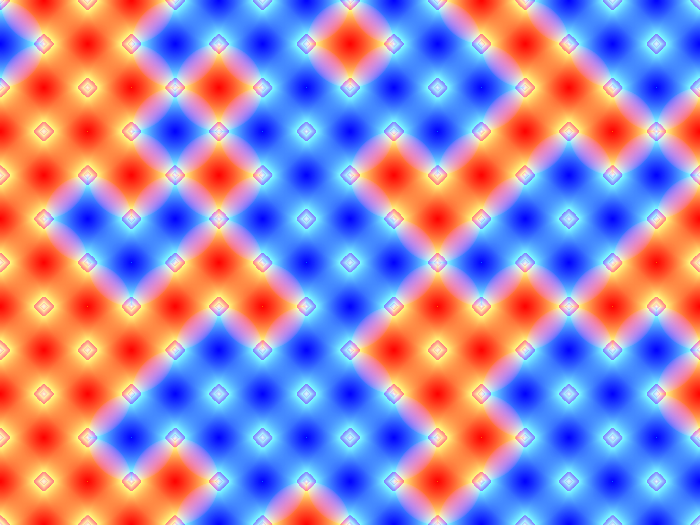

# wango

wang's tile artwork generator impl by go.




# features

* user-friendly tui.
* random seed and repeatable output.
* smooth color blending.
* various filters.

# millstone


```bash
# test
make test && open grid.png

# install
go install github.com/humbornjo/wango

# run
# - empty input will use default config instead
# - just run and press ENTER
wango
wango -s 114514 -p "#ff00ff;#00ff00"

# uninstall 
rm $GOPATH/bin/wango
```

# todo

[x] seed support
 
[x] add some filters like sobel, etc.

[x] prettier layout

# usage 

refer to help subcommand.
```go
wango help

```

# reference
- [charmbracelet/bubbletea](https://github.com/charmbracelet/bubbletea)
- [tsoding/wang-tiles](https://github.com/tsoding/wang-tiles)
- [fogleman/WangTiling](https://github.com/fogleman/WangTiling)
